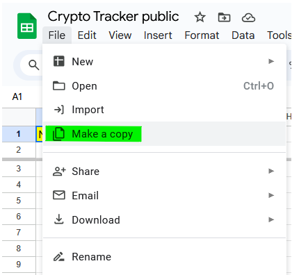
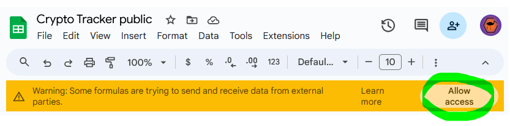
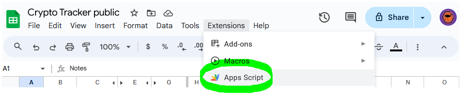
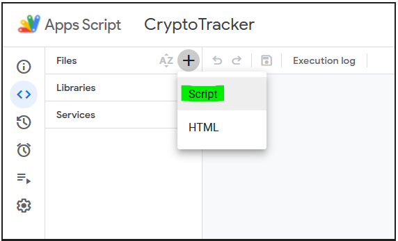
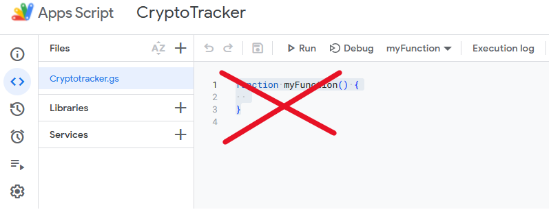
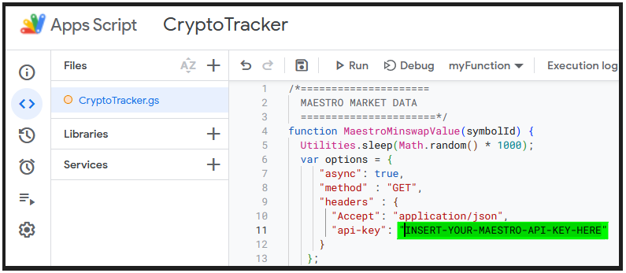
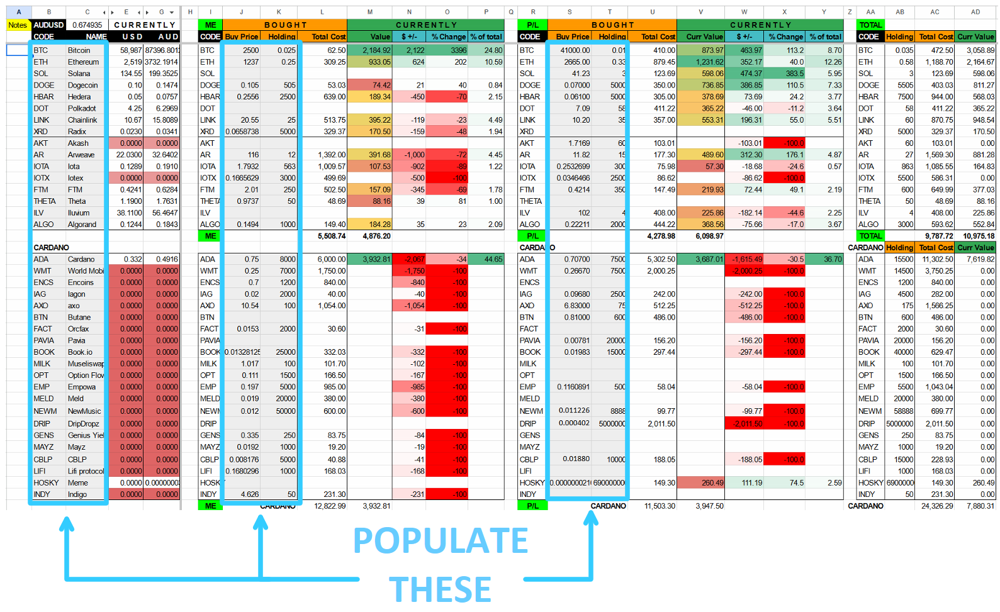
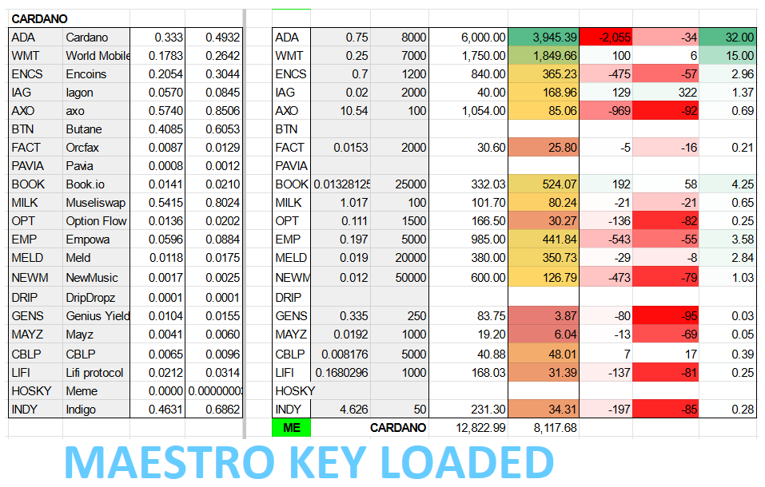

# Crypto Portfolio Tracker
Simple google sheet to keep track of portfolio, and help with bull market calculations/decisions.  One day hopefully.<br>
Not intended to be work of art, just simple colour coded guidance of what to check occasionally.<br>
**Uses Maestro subscription ($9pm) for Cardano Native Assets (only FT).**<br>

* Has variety of function/api calls used for different chains/tokens.<br>
* The top half is for non-Cardano, bottom half for Cardano.<br>
* There are two banks of numbers, to cover 2 entities (eg personal/company/other person etc)<br>
* Colour bands losses/gains by percent/proportion of portfolio<br>
* If API lookup fails, will colour current price cell red (initial Cardano state without Maestro api key in code)<br>

## Link to copy from
**NB Tokens/figures are testing samples only/not representative of any opinion/reality!!**<br><br>
https://docs.google.com/spreadsheets/d/1sxg8dYcztLyaOqMGgt0LuslZPJaG04j00L7uZoSv-8g/edit?usp=sharing
<br>

## Initial Setup
Make a copy:<br>
<br>
<p float="left">
  &nbsp;&nbsp;&nbsp;&nbsp;
  
  &nbsp;&nbsp;&nbsp;&nbsp;&nbsp;
</p>
<br>
Api calls enabled:<br>
<br>
<p float="left">
  &nbsp;&nbsp;&nbsp;&nbsp;
  
  &nbsp;&nbsp;&nbsp;&nbsp;&nbsp;
</p>
<br>
Create Script Project:<br>
<br>
<p float="left">
  &nbsp;&nbsp;&nbsp;&nbsp;
  
  &nbsp;&nbsp;&nbsp;&nbsp;&nbsp;
</p>
<br>
Add Blank Script file + replace template code with raw copy of:<br>

[CryptoTracker.gs](CryptoTracker.gs)

<br>
<br>
<p float="left">
  &nbsp;&nbsp;&nbsp;&nbsp;
  
  &nbsp;&nbsp;&nbsp;&nbsp;&nbsp;
  
</p>
<br>


Maestro plan required ($9pm) for price feeds (from Minswap):  https://www.gomaestro.org/pricing<br>
Copy Maestro key into script as below, then click save:<br>
<br>
<p float="left">
  &nbsp;&nbsp;&nbsp;&nbsp;
  
  &nbsp;&nbsp;&nbsp;&nbsp;&nbsp;
</p>
<br>
Populate grey shaded columns:<br>
<br>
<p float="left">
  &nbsp;&nbsp;&nbsp;&nbsp;
  
  &nbsp;&nbsp;&nbsp;&nbsp;&nbsp;
</p>
<br>
With Maestro lookup running:<br>
<br>
<p float="left">
  &nbsp;&nbsp;&nbsp;&nbsp;
  
  &nbsp;&nbsp;&nbsp;&nbsp;&nbsp;
</p>
<br>

## Notes:
* Delete columns R->AD if only one entity
* Populate the grey columns only and the rest will sort itself out (B,C,J,K + S,T if needed for second entity)
* Change formula in cell C1 to set currency conversion to what suits, or replace with number 1 to leave as USD<br>
* Colour coding from green->red for gains/loss proportions within portfolio
* Museliswap lookup worked best for zero value Hosky at time of assembly which is why it is different
* Crypto prices website lookups free - BUT MAY ONLY UPDATE DAILY
* Coingecko code from https://github.com/Eloise1988/COINGECKO included, can put CoinGecko api key in it also (but not as good for CNT)
<br><br><br>


## Help comment within Spreadsheet:
```
Covers personal + company.  If personal only can delete columns R->AD
Requires access to fetch external data when request pops up as banner
Enter buy price+Holding values, and the rest will sort itself out (once Maestro API key added to code)

------------------------------
CURRENCY CHANGES - set for AUD because that is where Bin Chickens are native
------------------------------
To change:
lookups are all done in USD, then converted using AUD to USD exchange rate in cell D1
D1 - change the exchange rate to GDP/CAN/etc to suit
     -  USD just enter number 1 so no translation is done
    - the buy prices are in local currency (AUD in this case)


-------------------------------
GOMAESTRO CALLS - vastly better than coingecko for cardano (as gecko doesn't have all tokens), but is paid
-------------------------------
Get an API key and insert into the code - Menu/Extensions/Apps Script/Cryptotools/MaestroMinswapValue
Free account doesn't have prices (last I checked)
Set to lookup from Minswap
https://dashboard.gomaestro.org/  + create account
https://mainnet.gomaestro-api.org/v1


------------------------
COINGECKO API - flaky but free.  Sometimes doesn't respond.  Doesn't have less well known cardano tokens
------------------------
Did not use API key which can be gotten for free from Coingecko
Uses code from:
       https://github.com/Eloise1988/COINGECKO
       https://www.youtube.com/watch?v=___BlVNV1T8
Copied raw gs file into scripts as new script
If your token isn't returning and you think it should be, it may be more recent than the stored references.  Update the massive text json line at the end of the script with all the current Coingecko code translations from:
    https://api.charmantadvisory.com/COINGECKOID/json


------------------------------------
CRYPTO PRICES WEBSITE - free+fast+simple URL call, BUT ONLY UPDATE MAYBE DAILY!!!
------------------------------------

-------------------------------
MUSELISWAP CALLS - only using for Hosky as often timed out (but was free+not intended for this usage!), however gets decimals right for "near zero value"
-------------------------------
MuseliSwap call using their ticker json and function sourced from:
      https://twitter.com/cardanostra/status/1488522351985799173
      https://analyticsv2.muesliswap.com/ticker

function MuesliswapTicker(symbolId, field='last_price') {
  const res = UrlFetchApp.fetch('https://analytics.muesliswap.com/ticker');
  const json   = JSON.parse(res.getContentText());
  return [json[symbolId][field]]
}
example call converting via ADA price to AUD:
=MuesliswapTicker("8a1cfae21368b8bebbbed9800fec304e95cce39a2a57dc35e2e3ebaa.MILK_ADA")*$E$24/1000000
=MuesliswapTicker("a0028f350aaabe0545fdcb56b039bfb08e4bb4d8c4d7c3c7d481c235.HOSKY_ADA")*$E$24/1000000
```
